```{r setup, include=FALSE}
knitr::opts_chunk$set(echo = FALSE)
```

### 1. Proposal Introduction

The fictious town of Engagement, Ohio is marketed as the future of the USA. In keeping with this, the city is studying opportunities to ensure competitiveness in the future. 

We have a sample of 1000 volunteers who provided data which records the places they visit, their spending, and their purchases, among a host of other information using the city’s urban planning app. 

We aim to come up with a with insights via a platform that will be able to be easily accessed and modified by an end user. It also has to be able to wrangle large amounts of data and smooth. To do this we will use open-source and freely available- R. We will be leveraging to Shiny, ggplot2 and other relevant R packages to create an interactive website to visualize business prosperity, financial health of the residents and health of employers.  

### 2. Literature Review

Given that there is no true town of Engagement, Ohio, we will look at literature available on Ohio as a state as a reference. 

Ohio had a gross state product of 615.6bn with a growth of 1.5% over 5 years, this is the 30th out of the 50 US states. The economy of Ohio (based on 2018 data) is comprised primarily of Manufacturing (18.5%), Real estate (12.2%), Financial service (10.3%), Healthcare (9.8%) (IBISWorld, 2022). Up and coming sectors are materials extraction (25.7% growth), Finance (8%), Logistics (7.6%) and Construction (6.7%)  (IBISWorld, 2022). So key opportunities on a state level would lie in financial services if looking at a large industry with great growth potential. We will look to augment this view with our study. 

Shiny1 is an open R package, free of charge, for building an interactive modern web apps from R. It can be either standalone app or embedded in R Markdown documents. According to an article shared by Debolina Biswas2, compared to other visualisation tool, such as Tableau, Shiny can connect with any data source, offers powerful data manipulation or wrangling and analysis tools, as well as statistical modelling and advanced forecasting packages. However, the user must know coding which may be challenging sometimes for non-coders.  

Data visualisation3 represents information and data with visual elements like charts, graphs, and maps, so that users can easily see and understand trends, outliers, and patterns in data. There are many different visualisation techniques4, for example, a timeline chart is very effective to visualize a sequence of events in chronological order.  

In this project, our team will use Shiny and utilize the most appropriate visualisation to curate a study on how the city’s economics situation changes over the study period.  
### 3. Project Objectives

The objective of this project is to use suitable visualisations to address how the economic condition of the city changes over the study period. Based on available data, we will zoom into how businesses are performing, the job market, and standard of living of the residents. We plan to plot the following graphs in our R Shiny app:  

##### Businesses:  

- Utilization across the entire F&B sector,   
- Foot traffic to individual establishments,   
- Net profit of individual establishments.   

##### Residents  

- Typical resident’s net income from salary  
- Typical resident's expenditure (rent, food, entertainment etc.) to understand what the +typical resident spends their money on. 

##### Demographic (education, kids, age) impact on the 2 above quantities 

- The impacts of income and spending on happiness.  
- Health of employers within the city, through observable patterns and turnover.   
- Assess the turnover rates of employers by correlating the sample’s job changes with the available employers by location.      
- Generate some geographic insights to see if there are certain regions which might be showing ‘dead zones’  

### 4. Dateset

The data set is obtained from https://vast-challenge.github.io/2022/. It contains 1000 Resident records over a 15-month period starting 1st March 2022.   
Datasets that are relative to the challenge our study will explore are as follows:  

- CheckinJournal.csv: contains participants Id, timestamp, venue Id and venue type. Can be used to explore challenge 1: health of business by calculating traffic in each business throughout the study period.  
- FinancialJournal.csv: contains participants Id, timestamp, expense category and amount of transaction. Can be used to explore challenge 2: health of residents by calculating savings of residents throughout the study period.  
- Employers.csv, Jobs.csv: contains unique Id of employers and jobs, location of employers and building they are in, hourly rate, education requirements and other information of jobs. Can be used to explore challenge 3: health of employers by calculating turnover rate and graph employers’ location in map. 

### 5. Approach

Diagram 1: Process Diagram
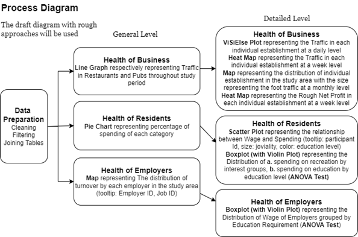

The Process Diagram demonstrates the overall process of group project: first, with proper R packages to prepare data and obtain data with structures that we need for the following data exploration; then, we use simple static visualisation methods to get an overview of the patterns for each challenge; last, we use more complicated interactive visualisation methods to explore and demonstrate more detailed information of each challenge. 

#### 5.1 Data Preparation 

#### 5.2 Early Prototypes and Storybords
#### 5.2.1 Health of Business 

Health of a business will be looked at on 3 main metrics:  

1) Foot traffic to individual establishments  
2) Net profit (Revenue) of individual establishments  
3) number of company shut down (to explore)   

#### 5.2.1.1 Utilization across the entire F&B 

To establish the health of the entire industry, one metric to understand is how much of the addressable market is being engaged. In order to do this, we will be looking at how many visitors are coming to pubs and restaurants from our sample. Given the entire addressable market is the whole population, we can see if there is room to grow for the F&B industry here. We can assess the following insights on pubs and restaurant: 

1) Market saturation 
2) Seasonality of F&B consumption
3) The trend of F&B business over the study period 
4) (to improve graphs by adding statistics, uncertainty/?filter/ expenditure of customers, weekly, monthly sales boxplot)  

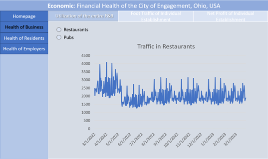

#### 5.2.1.2 Foot traffic to individual establishments 

One level below the entire industry, we look at how each individual establishments are attracting customers to: 

Propose manpower plans based on lulls and peaks in business. 

Identify potentially floundering businesses by geography or if there is an independence from geography. 
(to use less overview of data)  
(# of employee change, churn, etc)

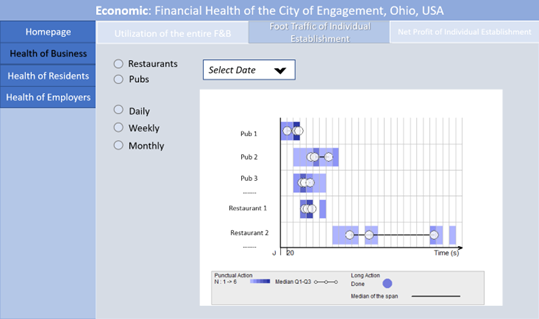
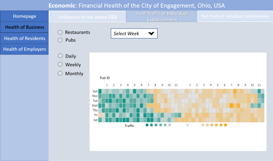
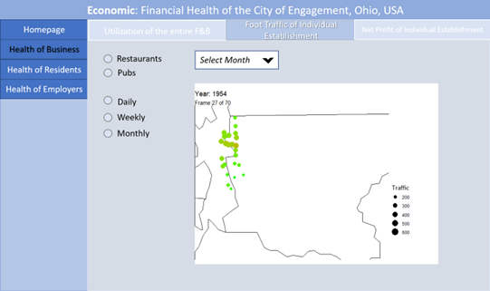

#### 5.2.1.3 Net profit of individual establishments 

Beyond the foot traffic, we also further look to ensure that foot traffic does indeed provide actual revenue to the businesses. We will be looking at a weekly heatmap to identify which periods are the most profitable for the respective businesses to plan their revenue streams. We could potentially identify higher value customers. 
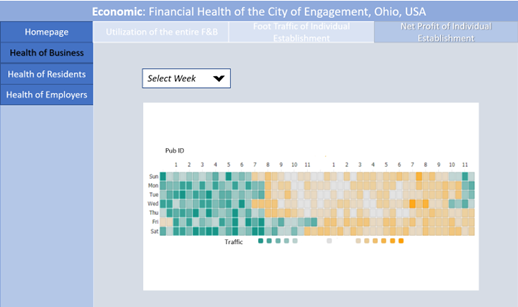

##### 5.2.2 Health of Residents 

We will do a breakdown of the typical resident's expenditure (rent, food, entertainment etc.) to understand what the typical resident spends their money on. 
1) explore salary and expenditure pattern  
2)  Joviality vs salary, education, or recreational activities 
3) (add interactivity, make the chart more revealing, e.g. tooltip)

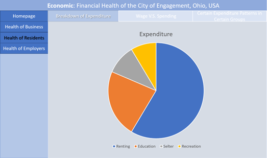

Going a level down, we will then try to understand the savings rate of the sample and see if there is any relationship of wages and expenditure to education level. 
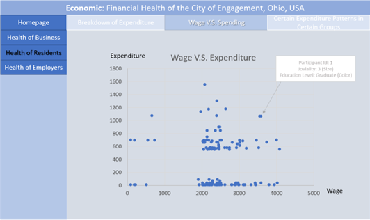

We will then endeavour to understand how education spending is related to having kids and education level of individuals 
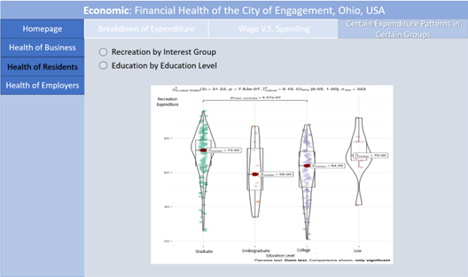

##### 5.2.3 Job Market

We will be trying to assess the turnover rates of employers by correlating the sample’s job changes with the available employers by location. This might be able to generate some geographic insights, however this is limited due to the high number of companies relative to the sample’s participants 

1) Map with companies, tool tip with number of employees; number of employees trend over time) - company shown as a dot on the map, and tooltip of line graph to show change of number of employees over time)   
2) To explore, open job opportunities, overall No. Of employers 
3) (closed-down business?, repetitive maybe) 

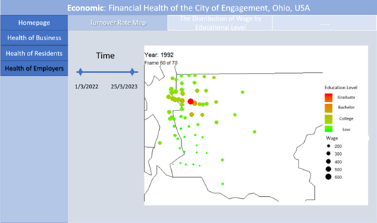


An indicator of employers longer economic health is the quality of jobs provided. We will be using the wages of jobs offered as an indicator of this. 
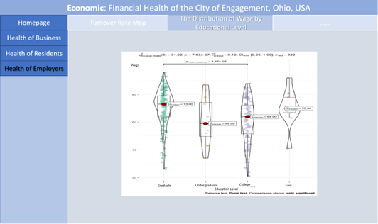

### 6. Project Timeline

The project timeline is set as follows:


### 7: Software Tool and R packages

[`Shiny`](https://shiny.rstudio.com/): R package that makes it easy to build interactive web apps straight from R.    
[`tidyverse`](https://www.tidyverse.org/): opinionated collection of R packages designed for data science.   
[`igraph`](https://igraph.org/r/): a library collection for creating and manipulating graphs and analyzing networks.   
[`tidygraph`](https://cran.r-project.org/web/packages/tidygraph/tidygraph.pdf):an approach to manipulate these two virtual data frames using the API defined in the 'dplyr' package, as well as provides tidy interfaces to a lot of common graph algorithms.    
[`ggraph`](https://cran.r-project.org/web/packages/ggraph/index.html#:~:text=ggraph%20is%20an%20extension%20of,up%20plots%20layer%20by%20layer.): ggraph is an extension of the ggplot2 API tailored to graph visualizations and provides the same flexible approach to building up plots layer by layer.    
[`visNetwork`](https://cran.r-project.org/web/packages/visNetwork/vignettes/Introduction-to-visNetwork.html#:~:text=visNetwork%20is%20a%20R%20package,%2Fdatastorm%2Dopen%2FvisNetwork.): a R package for network visualization.    
[`lubridate`](https://lubridate.tidyverse.org/): Lubridate makes it easier to do the things R does with date-times and possible to do the things R does not.    
[`clock`](https://clock.r-lib.org/): an R package for working with date-times.  

### 8: References 

[1] Siny from R Studio, https://shiny.rstudio.com/   
[2] Debolina Biswas, 5 Oct 2021, https://analyticsindiamag.com/tableau-vs-shiny-which-one-should-you-pick-for-data-visualisation/   
[3] https://www.tableau.com/learn/articles/data-visualization   
[4] 17 Data Visualisation Techniques All Professionals Should Know, Kelsey Miller,  
https://online.hbs.edu/blog/post/data-visualization-techniques 

 


