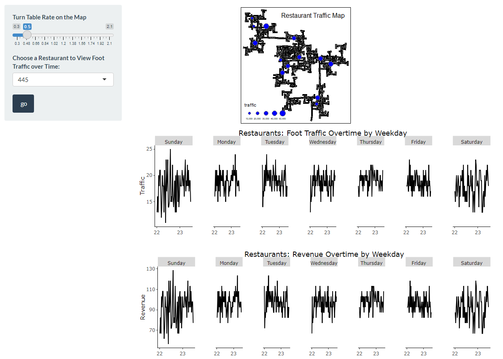
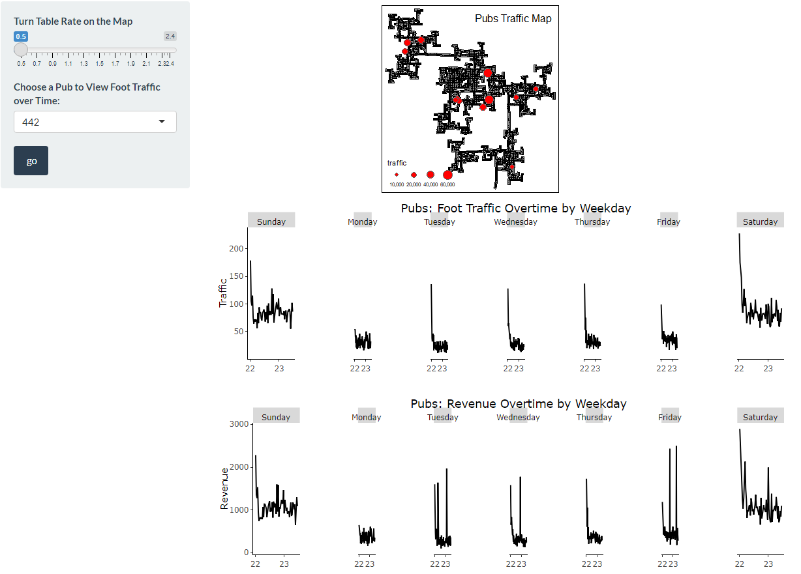
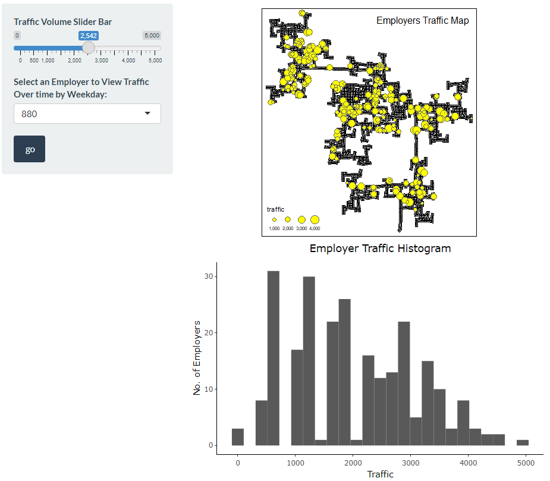
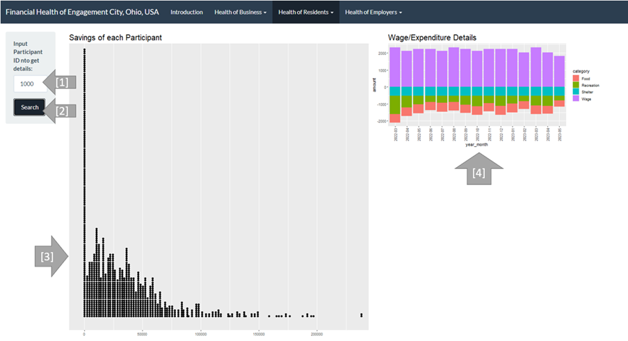
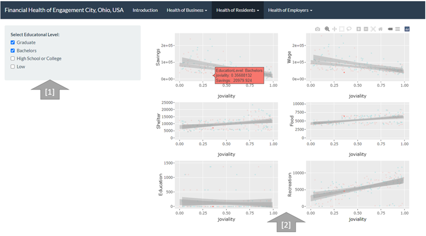
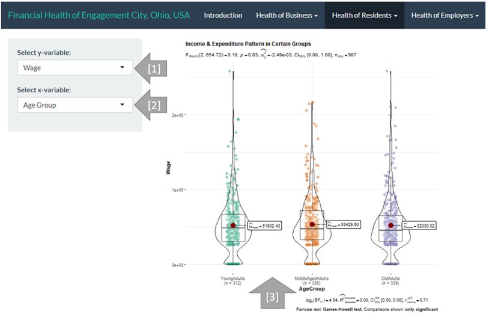
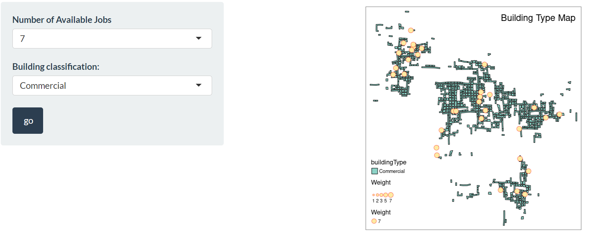
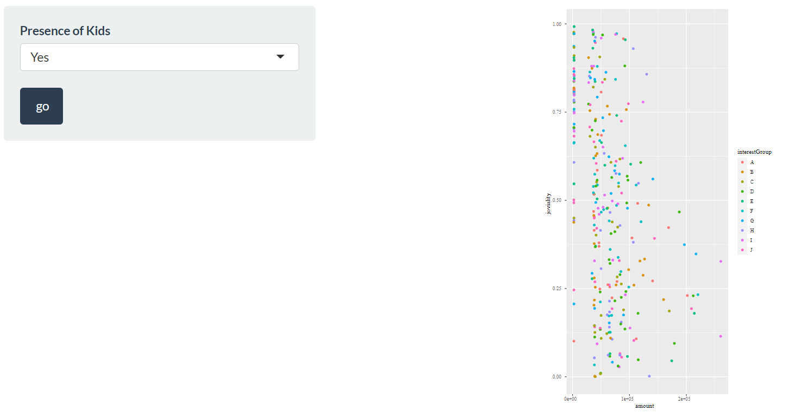

```{r setup, include=FALSE}
knitr::opts_chunk$set(echo = TRUE)
```

# 1. Introduction Page

On this page, we represent the introduction and overview of our application.

```{r fig.dim = c(80, 60), echo=FALSE}
knitr::include_graphics("image/team.png")
```


# 2.	Health of Business

## 2.1	Restaurants
The map below shows the locations of all restaurants in the city. The size of the bubbles indicate the total foot traffic during the study period, the visible bubbles can be toggled with the "Turn Table Rate on the Map" slider.There is also drop down menu to select the restaurants by ID number to display cycle charts by weekday for its traffic and revenue time series over the study period.

```{r fig.dim = c(8, 6), echo=FALSE}

```

## 2.2	Pubs
The map below shows the locations of all pubs in the city. The size of the bubbles indicate the total foot traffic during the study period, the visible bubbles can be toggled with the "Turn Table Rate on the Map" slider. There is also drop down menu to select the pub by ID number to display cycle charts by weekday for its traffic and revenue time series over the study period.

```{r fig.dim = c(8, 6), echo=FALSE}

```

## 2.3	Employers
The map below shows the locations of all employers in the city. The size of the bubbles indicates the total foot traffic during the study period. We can toggle the volumes of foot traffic shown using the slider of "Traffic Volume Slider Bar".

There is a histogram below shows the distribution of the total traffic for all employers. 

```{r fig.dim = c(8, 6), echo=FALSE}

```

The employers can also be filtered in the drop down by employer number to show a cycle chart by weekday for its traffic time series over the study period. It can be observed that the traffic has a steep decline from 2022 to 2023 for Tuesday, Wednesday, Thursday and Friday. A sample for employer 880 is below: 

```{r fig.dim = c(8, 6), echo=FALSE}
knitr::include_graphics("image/employers_880_cyclechart.png")
```

# 3.	Health of Residents

## 3.1	Wage and Expenditure Pattern

In this part, the [3] dot plot shows the distribution of Savings of every participant. Filling in the participant ID in [1] the box and click [2] ‘Search’ button, users can search for the details of wage and expenditure of certain participant showing by [4] a line chart.


```{r fig.dim = c(8, 6), echo=FALSE}

```

## 3.2	Wage/Expenditure v.s. Joviality

In this part, users can select different education level [1] to see the relationship between wage/expenditure and joviality in the group of [2] scatter plots. The users can also check the position of each point (participant) by clicking on one point of one plot and the other corresponding points in other plots will be highlighted.

```{r fig.dim = c(8, 6), echo=FALSE}

```

## 3.3	ANOVA

In this part, ANOVA test could be done by selecting y-variable [1] and x-variable [2]. In the outcome plot [3], violin plot of each group (x variable) could be shown with the mean and significance between groups.

```{r fig.dim = c(8, 6), echo=FALSE}

```

# 4.	Health of Employers

## 4.1  Available Jobs by location
We establish (geographically) the number of jobs available and building type (commercial, residential, school) to see where the job opportunities are and potential 'deadzones' without jobs or people nearby.

User can toggle the company locations by the number of available jobs in the "Number of Available Jobs" drop down. This can be overlaid with the types of buildings (Commercial, Residential and School).

```{r fig.dim = c(8, 6), echo=FALSE}

```

## 4.2 Joviality vs total income
Does money equal happiness?
We establish a dot plot of individual participants happiness against wages. The end user can filter these data points by "Presence of kids" in the drop down view the results by education level by hovering over the dots. These can be used to identify potential areas of churn to be improved on for employers and potential policies to improve attractiveness of jobs.


```{r fig.dim = c(8, 6), echo=FALSE}

```