```{r setup, include=FALSE}
knitr::opts_chunk$set(echo = FALSE)
```

### 1. Proposal Introduction

The fictitious town of Engagement, Ohio is marketed as the future of the USA. In keeping with this, the city is studying opportunities to ensure competitiveness in the future. 

We have a sample of 1000 volunteers who provided data which records the places they visit, their spending, and their purchases, among a host of other information using the city’s urban planning app. 

We particularly endeavour to establish the economic health through 3 metrics: businesses, people’s employment churn and standards of living. 

### 2. Literature Review

Given that there is no true town of Engagement, Ohio, we will look at literature available on Ohio as a state as a reference. 

Ohio had a gross state product of 615.6bn with a growth of 1.5% over 5 years, this is the 30th out of the 50 US states. The economy of Ohio (based on 2018 data) is comprised primarily of Manufacturing (18.5%), Real estate (12.2%), Financial service (10.3%), Healthcare (9.8%) (IBISWorld, 2022). Up and coming sectors are materials extraction (25.7% growth), Finance (8%), Logistics (7.6%) and Construction (6.7%)  (IBISWorld, 2022). So key opportunities on a state level would lie in financial services if looking at a large industry with great growth potential. We will look to augment this view with our study. 


### 3. Project Objectives

The objective of this project is to provide suitable visualisations for users to: 

Businesses which appear to be more prosperous and conversely, which are dying. 

Financial health of the residents through wages against the cost of living in Engagement and demographic tendencies. 

Health of employers within the city, through observable patterns and turnover. 

### 4. Dateset

The data set is obtained from https://vast-challenge.github.io/2022/. It contains 1000 Resident records over a 15-month period starting 1st March 2022. 

Datasets that are relative to the challenge our study will explore are as follows: 

CheckinJournal.csv: contains participants Id, timestamp, venue Id and venue type. Can be used to explore challenge 1: health of business by calculating traffic in each business throughout the study period. 

FinancialJournal.csv: contains participants Id, timestamp, expense category and amount of transaction. Can be used to explore challenge 2: health of residents by calculating savings of residents throughout the study period. 

Employers.csv, Jobs.csv: contains unique Id of employers and jobs, location of employers and building they are in, hourly rate, education requirements and other information of jobs. Can be used to explore challenge 3: health of employers by calculating turnover rate and graph employers’ location in map. 

### 5. Approach

Diagram 1: Process Diagram
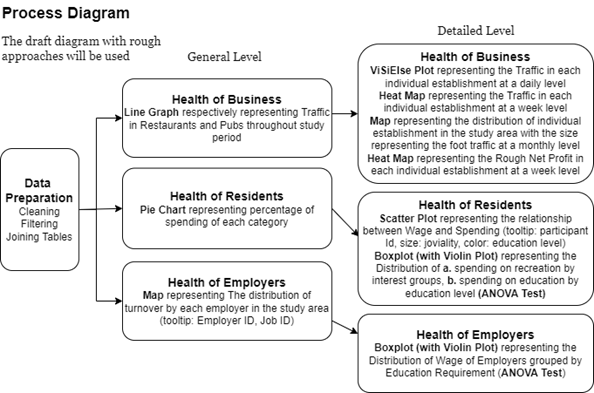

The Process Diagram demonstrates the overall process of group project: first, with proper R packages to prepare data and obtain data with structures that we need for the following data exploration; then, we use simple static visualisation methods to get an overview of the patterns for each challenge; last, we use more complicated interactive visualisation methods to explore and demonstrate more detailed information of each challenge. 

#### 5.1 Data Preparation 

#### 5.2 Early Prototypes and Storybords
#### 5.2.1 Health of Business 

Health of a business will be looked at on 3 main metrics:  

1) Utilization across the entire F&B sector;  

2) Foot traffic to individual establishments;  

3) Net profit of individual establishments. 

#### 5.2.1.1 Utilization across the entire F&B 

To establish the health of the entire industry, one metric to understand is how much of the addressable market is being engaged. In order to do this, we will be looking at how many visitors are coming to pubs and restaurants from our sample. Given the entire addressable market is the whole population, we can see if there is room to grow for the F&B industry here. We can assess the following insights on pubs and restaurant: 

1) Market saturation 

2) Seasonality of F&B consumption 

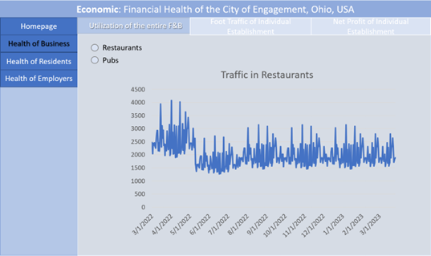

#### 5.2.1.2 Foot traffic to individual establishments 

One level below the entire industry, we look at how each individual establishments are attracting customers to: 

Propose manpower plans based on lulls and peaks in business. 

Identify potentially floundering businesses by geography or if there is an independence from geography. 

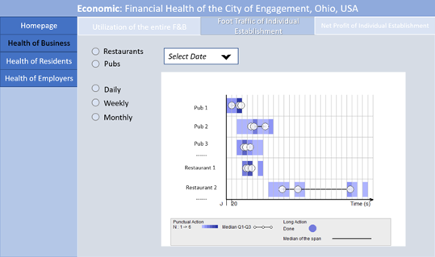
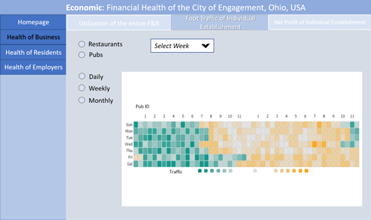
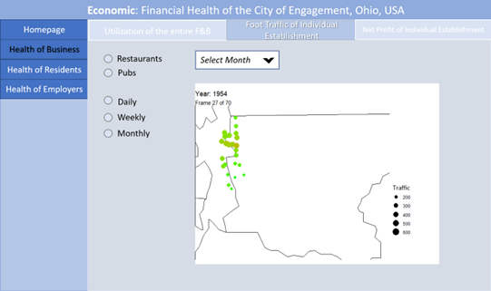

#### 5.2.1.3 Net profit of individual establishments 

Beyond the foot traffic, we also further look to ensure that foot traffic does indeed provide actual revenue to the businesses. We will be looking at a weekly heatmap to identify which periods are the most profitable for the respective businesses to plan their revenue streams. We could potentially identify higher value customers. 
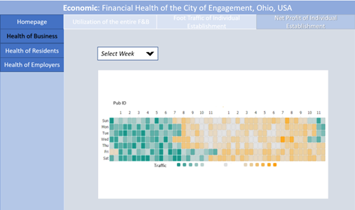

##### 5.2.2 Health of Residents 

We will do a breakdown of the typical resident's expenditure (rent, food, entertainment etc.) to understand what the typical resident spends their money on. 
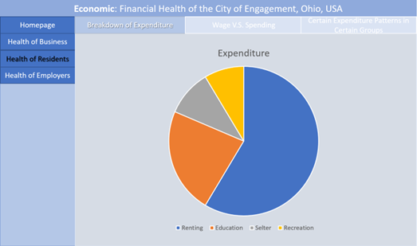

Going a level down, we will then try to understand the savings rate of the sample and see if there is any relationship of wages and expenditure to education level. 
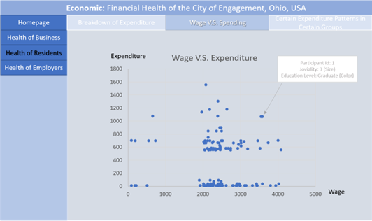

We will then endeavour to understand how education spending is related to having kids and education level of individuals 
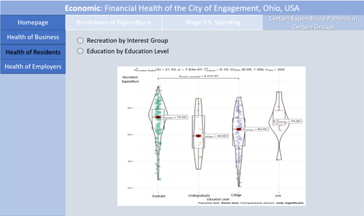

##### 5.2.3 Health of Employers 

We will be trying to assess the turnover rates of employers by correlating the sample’s job changes with the available employers by location. This might be able to generate some geographic insights, however this is limited due to the high number of companies relative to the sample’s participants 
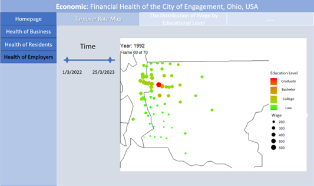

An indicator of employers longer economic health is the quality of jobs provided. We will be using the wages of jobs offered as an indicator of this. 
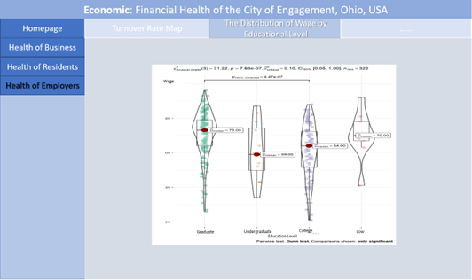

### 6. Project Timeline

The project timeline is set as follows:


### 7: Software Tool and R packages


